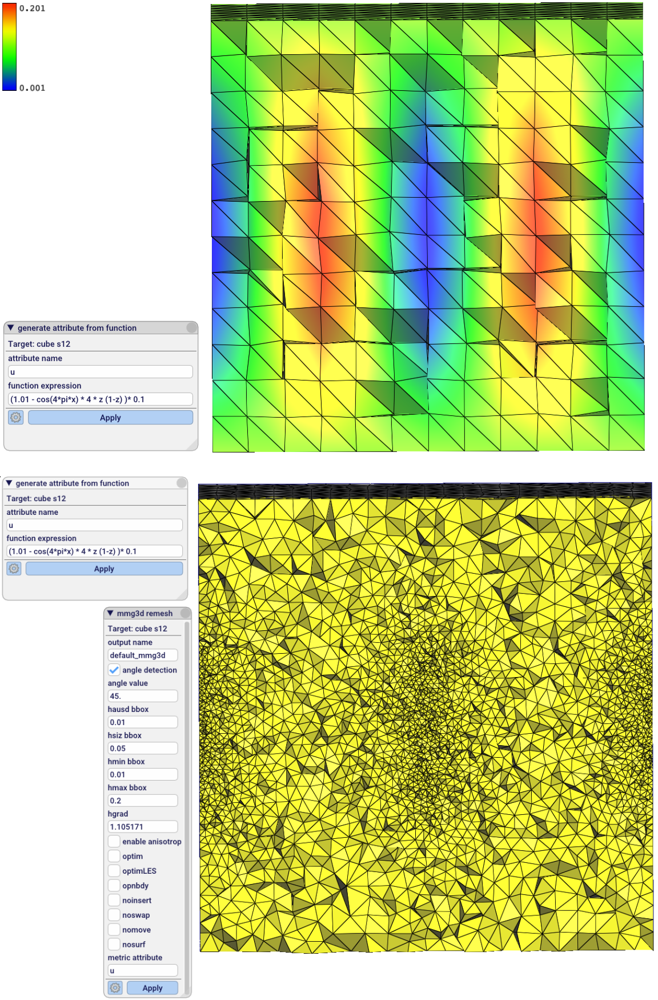

# mmgig: MmgTools in Graphite

This is a [Graphite](http://alice.loria.fr/software/graphite) plugin that links
with the [MmgTools](https://www.mmgtools.org/) remeshing library.

The implementation includes wrappers for the *mmgs* and *mmg3d* remeshing
functions.  See the [MmgTools
documentation](https://www.mmgtools.org/mmg-remesher-try-mmg/mmg-remesher-options)
for more details on the options.

### Install

First, you need to clone and build *MmgTools* with the BUILD_SHARED_LIBS option ON

    https://github.com/MmgTools/mmg.git /path/to/mmg
    cd /path/to/mmg
    mkdir build
    cd build
    cmake .. -DBUILD_SHARED_LIBS=ON
    make -j

Assuming that you have a working *Graphite* setup, the steps to install this plugin are:

    // get the plugin source code
    mkdir /path/to/this/plugin
    git clone https://github.com/mxncr/mmgig.git /path/to/this/plugin

    // tell graphite to build the new plugin
    ln -s /path/to/this/plugin /path/to/graphite/plugins/OGF/mmgig
    echo "add_subdirectory(mmgig)" >> /path/to/graphite/plugins/OGF/Plugins.txt

Next **important** is step is to tell this plugin where mmg is. In the
CMakeLists.txt, ensure the variables MMG_DIR, MMG_INCLUDE_DIR and MMG_LIBRARY
are set to the right locations.

Now you should:
- configure and build Graphite (which will build this plugin)
- launch Graphite, go to *Files > Preferences > Plugins*, enter *mmgig* and click *Add*, then *Save configuration file*
- restart Graphite, from now on you should have the *mmgig* plugin working (right click on a mesh in Scene and check if the MmgTools command menu is present)

### Details 

The input `GEO::Mesh` is converted into a `MMG5_pMesh`, then `mmg` remeshing
functions are called and the result is converted back into a `GEO::Mesh`.

If the `GEO::Mesh` contains a vertex attribute (a `double` at each vertex), this field can
be used to prescribe the mesh size locally for *mmg* algorithms.

### Screenshot

